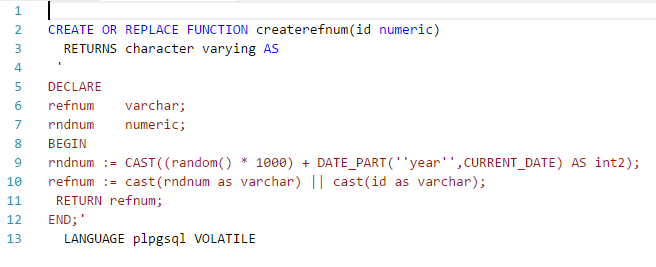
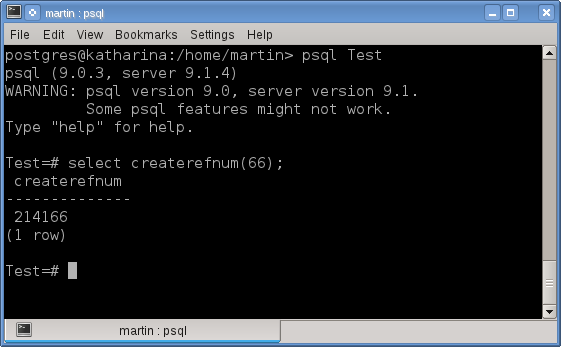
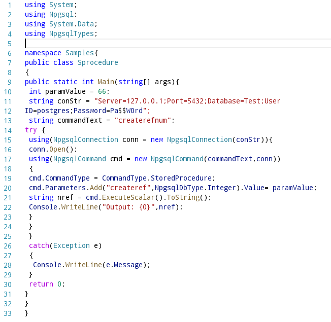
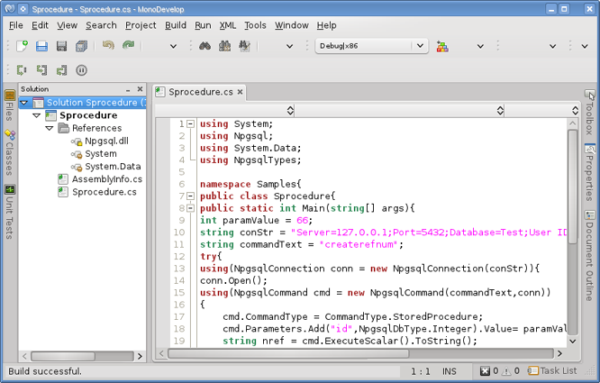
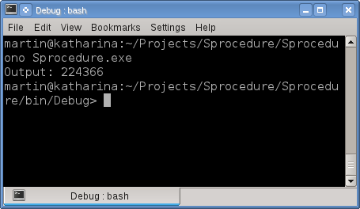
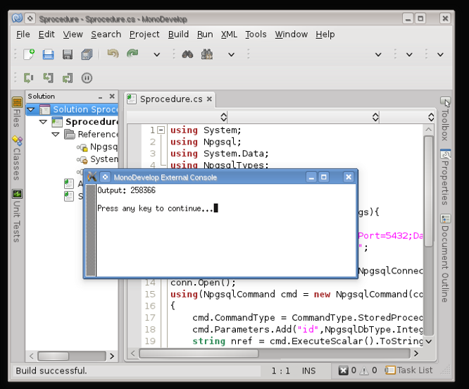

# Utilizando parameterized commands (comandos con parámetros) de ADO.NET en PostgreSQL con C#.

Aunque este tutorial se centra en <a href="http://www.postgresql.org/">PostgreSQL</a>, utilizo la clase genérica <a href="http://msdn.microsoft.com/en-us/library/system.data.common.dbcommand.aspx">DbCommand</a>, ya que estos conceptos son aplicables a otros manejadores de bases de datos como Oracle o SQL Server, únicamente reemplazando las clases <i>DbCommand</i> y <i>DbParameter</i> por las clases específicas de ADO .NET para estas bases de datos.

La clase <a href="http://msdn.microsoft.com/en-us/library/system.data.common.dbcommand.aspx">DbCommand</a> de ADO .NET nos proporciona la capacidad de ejecutar comandos parametrizados, lo que nos permite pasar información en tiempo de ejecución a los store procedures o comandos SQL que nuestra aplicación .NET envié hacia la base de datos.
Estos parámetros  se clasifican por su valor dentro de la enumeración <a href="http://msdn.microsoft.com/en-us/library/system.data.parameterdirection.aspx">ParameterDirection</a>:
<ul>
	<li><b>Input:</b> Son el tipo predeterminado,  envía los valores hacia la base de datos, es posible tener múltiples parámetros de entrada.</li>
	<li><b>Output:</b> Similar a los parámetros Input, solo que regresan los valores de retorno una vez que el comando es ejecutado, es posible tener múltiples parámetros de salida.</li>
	<li><b>InputOutput:</b> El parámetro es capaz de enviar y recibir un valor después de que el comando es ejecutado.</li>
	<li><b>ReturnValue:</b> El parámetro representa el valor de retorno de la función.</li>
</ul>

El uso de comandos parametrizados nos ofrece los siguientes beneficios:
<ul>
	<li>Nos permite definir el tipo de dato del parámetro.</li>
	<li>Evita la concatenación de sentencias SQL en el código, con lo que disminuye el riesgo de un ataque <a href="http://en.wikipedia.org/wiki/SQL_injection"> SQL Injection</a>.</li>
	<li>Obtenemos un mejor rendimiento, las consultas pre-compiladas tienen un mejor desempeño al ejecutarse ya que el plan de ejecución es reutilizado para la misma consulta en vez construirlo repetidamente en cada ejecución como ocurre con las consultas SQL literales.</li>
	<li>Los parámetros son revisados y validados para comprobar que no exista código malicioso, una de esas validaciones es la longitud, por ejemplo si el parámetro especifica una longitud de 50 caracteres, entonces solo 50 caracteres serán aceptados.</li>
</ul>
DbCommand tiene la propiedad <a href="http://msdn.microsoft.com/en-us/library/system.data.common.dbcommand.parameters.aspx">Parameters</a> que representa la colección de parámetros que están asociados al comando SQL. Estos parámetros son representados por el objeto <a href="http://msdn.microsoft.com/en-us/library/system.data.common.dbparameter.aspx">DbParameter</a> el cual tiene las siguientes propiedades:
<ul>
	<b>DbType</b>: Representa el tipo de dato de la fuente de datos como un tipo CLR. 
	<b>Direction:</b> Indica si el parámetro es de entrada, de salida o bidireccional. 
	<b>IsNullable:</b> Indica si el parámetro acepta valores nulos. 
	<b>ParameterName:</b> Representa el nombre del parámetro. 
	<b>Size:</b> Representa la longitud del parámetro. 
	<b>Value:</b> Obtiene u establece el valor del parámetro.
</ul>

Como ejemplo un programa C# que muestra el uso de los comandos parametrizados llamando a una función de PL/pgSQL en PostgreSQL que realiza una concatenación de un número aleatorio, el año actual y el parámetro de entrada para crear un número distinto cada vez que se ejecute. El código PL/pgsql de la función es el siguiente:

<!--Code createrefnum-->

<!--Code-->
 
El resultado de la ejecución de la función es:
 

A continuación un ejemplo en C# en donde se muestra el uso de los parámetros ejecutando la función anterior con su parámetro de entrada (input) y recibiendo el valor de retorno.

<!--Code Sprocedure -->

<!--Code Sprocedure-->

Este ejemplo en MonoDevelop puede construirse como una aplicación de consola, agregando las refrencias al ensamblado <a href="http://npgsql.projects.postgresql.org/">Npgsql</a>, como se muestra en la siguiente imagen:
 

La salida de la ejecucción de este programa es:
 

Si se ejecuta desde MonoDevelop la salida es:

